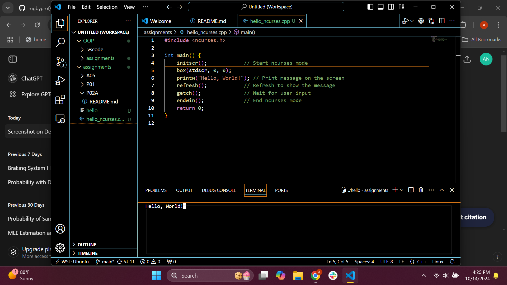

## P02A - Ncurses Test

In this assignment, I installed ncurses to my software system. The screenshot of the install being successful will be provide below.

### How to install N-curses:

Click [here](https://github.com/rugbyprof/2143-Object-Oriented-Programming/tree/master/Assignments/08-P02A) to get instructions on how to install nCurses to your laptop.

### Files Used:

Files : Description

[nCurses.cpp](https://github.com/aaniaahh/OOP/blob/main/assignments/P02A/hello_ncurses.cpp) : This file was used to show that nCurses was downloaded successfully.

### Screenshot proof:

